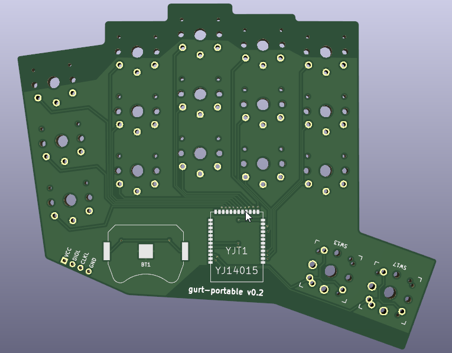

# gurt-portable
A wireless portable keyboard with a 34 key layout designed with simplicity in mind. 
##inspiration
This keyboard was based of durken1's *[pierce](https://github.com/durken1/pierce)*. The building instructions and bill of materials is identical to the wireless version and even uses the same dongle pcb. Just make sure to use the firmware from this repository or the keyboard will not work as expected. 

# v0.2 (not tested but probably better)
changes:
<ul>
  <li>Slightly bigger solderpads for the battery holders</li>
  <li>Thumbkeys has new footprints that can be rotated 90°</li>
</ul>

