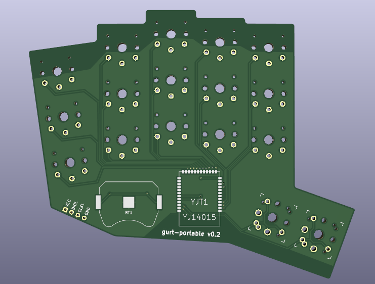

# gurt-portable
A wireless portable keyboard with a 34 key layout designed with simplicity in mind. 

## Inspiration
This keyboard was based of durken1's *[pierce](https://github.com/durken1/pierce)*. The building instructions and bill of materials is identical to the wireless version and uses the same dongle pcb. Just make sure to use the firmware from this repository or the keyboard will not work as expected. Big shoutout to durken for his work and for the help I got to make this project possible.

# v0.2 (not tested but probably better)
**changes:**
<ul>
  <li>Slightly bigger solderpads for the battery holders as I had some problems soldering the ones I ordered of Aliexpress.</li>
  <li>Thumbkeys has new footprints that allows the switches to be rotated 90°</li>
</ul>

